# Arquitetura de Comunicação Omnichannel - NXT Indústria e Comércio Ltda

## 🎯 Objetivo

Documentar a arquitetura completa de comunicação omnichannel que integra todos os sistemas de comunicação (WhatsApp, Instagram, Mercado Livre, Email, Telefone) com o ERP, CRM e sistema de suporte, garantindo experiência unificada e rastreamento completo das interações com clientes.

---

## 🏗️ VISÃO GERAL DA ARQUITETURA

### **Componentes Principais**

```mermaid
graph TD
    A[Clientes] --> B[Canais de Comunicação]
    B --> C[Sistema de Webhooks Centralizados]
    C --> D[Engine de Processamento]
    D --> E[CRM + Ticketing]
    D --> F[ERP + Vendas]
    D --> G[Sistema de Notificações]
    G --> H[Equipe NXT]
    
    B1[WhatsApp Z-API] --> C
    B2[Instagram Business] --> C
    B3[Mercado Livre] --> C
    B4[Email SMTP] --> C
    B5[Telefone/Chat] --> C
    
    E1[Leads] --> E
    E2[Tickets] --> E
    E3[Histórico] --> E
    
    F1[Pedidos] --> F
    F2[Clientes] --> F
    F3[Estoque] --> F
```



### **Fluxo de Dados Unificado**

1. **Captura**: Mensagens chegam pelos diversos canais
2. **Centralização**: Webhooks capturam e normalizam dados
3. **Processamento**: Engine analisa contexto e redireciona
4. **Ação**: Sistema executa ação apropriada (lead, ticket, venda)
5. **Resposta**: Retorno automático ou manual via canal original
6. **Rastreamento**: Histórico completo armazenado

---

## 🔗 INTEGRAÇÃO DOS SISTEMAS EXISTENTES

### **1. Webhook Central (WHK_*)**
```sql
-- Sistema já implementado em SISTEMA_WEBHOOKS_CENTRALIZADOS.md
-- Tabelas: WHK_01 a WHK_04
-- Função: fn_processar_webhook()
```

### **2. CRM e Leads (CAD_08_leads, CAD_09_interacoes_leads)**
```sql
-- Sistema já implementado em SISTEMA_CRM_LEADS_CLIENTES.md
-- Converte automaticamente leads → clientes
-- Rastreia todas interações
```

### **3. Sistema de Tickets (SPT_*)**
```sql
-- Sistema já implementado em SISTEMA_TICKETING_SUPORTE.md
-- Tabelas: SPT_01 a SPT_06
-- Integração com todos os canais
```

---

## 📱 ESPECIFICAÇÕES POR CANAL

### **Canal 1: WhatsApp Business (Z-API)**

#### **Configuração Webhook**
```sql
-- Já configurado em WHK_01_configuracao_webhooks
INSERT INTO whk_01_configuracao_webhooks (
    plataforma, nome_plataforma, endpoint_url, eventos_monitorados
) VALUES (
    'ZAPI', 
    'Z-API WhatsApp', 
    'https://api.nxt.com.br/webhooks/zapi',
    '["message.received", "message.sent", "message.read", "group.created"]'::jsonb
);
```

#### **Processamento Inteligente**
```sql
-- Regra para criar tickets automaticamente
INSERT INTO whk_03_processamento_regras (
    nome_regra, plataforma, evento_tipo, condicoes_ativacao, acao_tipo, mapeamento_dados
) VALUES (
    'WhatsApp - Suporte Automático',
    'ZAPI',
    'message.received',
    '{"messageType": "text", "fromMe": false}'::jsonb,
    'CRIAR_TICKET',
    '{
        "telefone_cliente": "$.phone",
        "assunto": "Atendimento WhatsApp",
        "descricao": "$.message.text",
        "canal_origem": "WHATSAPP",
        "prioridade": "MEDIA"
    }'::jsonb
);
```

#### **Respostas Automáticas**
```sql
-- Configurações no SPT_01_configuracao_suporte
UPDATE spt_01_configuracao_suporte SET
    auto_resposta_ativa = TRUE,
    mensagem_auto_resposta = 'Olá! Recebemos sua mensagem sobre equipamentos de mobilidade elétrica. Nossa equipe retornará em breve. Horário: Segunda a Sexta, 8h às 18h.',
    webhook_whatsapp_ativo = TRUE;
```

### **Canal 2: Instagram Business**

#### **Configuração para DMs e Comentários**
```sql
-- Regra para Instagram DMs
INSERT INTO whk_03_processamento_regras (
    nome_regra, plataforma, evento_tipo, condicoes_ativacao, acao_tipo, mapeamento_dados
) VALUES (
    'Instagram - DM para Lead',
    'INSTAGRAM',
    'messages',
    '{"object": "instagram", "field": "messages"}'::jsonb,
    'CRIAR_LEAD',
    '{
        "nome": "$.entry[0].messaging[0].sender.username",
        "origem_lead": "INSTAGRAM_DM",
        "canal_especifico": "Instagram Business",
        "observacoes": "$.entry[0].messaging[0].message.text",
        "produto_interesse": "Equipamentos de Mobilidade Elétrica"
    }'::jsonb
);

-- Regra para comentários em posts
INSERT INTO whk_03_processamento_regras (
    nome_regra, plataforma, evento_tipo, condicoes_ativacao, acao_tipo, mapeamento_dados
) VALUES (
    'Instagram - Comentário para Ticket',
    'INSTAGRAM',
    'comments',
    '{"object": "instagram", "field": "comments"}'::jsonb,
    'CRIAR_TICKET',
    '{
        "assunto": "Comentário Instagram",
        "descricao": "$.entry[0].changes[0].value.text",
        "canal_origem": "INSTAGRAM",
        "prioridade": "BAIXA"
    }'::jsonb
);
```

### **Canal 3: Mercado Livre**

#### **Integração com Vendas e Suporte**
```sql
-- Regra para perguntas de produtos
INSERT INTO whk_03_processamento_regras (
    nome_regra, plataforma, evento_tipo, condicoes_ativacao, acao_tipo, mapeamento_dados
) VALUES (
    'ML - Pergunta para Ticket',
    'ML',
    'questions',
    '{"topic": "questions", "resource": {"contains": "/questions/"}}'::jsonb,
    'CRIAR_TICKET',
    '{
        "assunto": "Pergunta Mercado Livre",
        "descricao": "$.question.text",
        "canal_origem": "MERCADO_LIVRE",
        "ml_question_id": "$.question.id",
        "prioridade": "ALTA"
    }'::jsonb
);

-- Regra para novos pedidos
INSERT INTO whk_03_processamento_regras (
    nome_regra, plataforma, evento_tipo, condicoes_ativacao, acao_tipo, mapeamento_dados
) VALUES (
    'ML - Pedido para Cliente',
    'ML',
    'orders',
    '{"topic": "orders", "resource": {"contains": "/orders/"}}'::jsonb,
    'CRIAR_PEDIDO',
    '{
        "ml_order_id": "$.id",
        "valor_total": "$.total_amount",
        "status": "$.status",
        "data_venda": "$.date_created",
        "canal_venda": "MERCADO_LIVRE"
    }'::jsonb
);
```

### **Canal 4: Email SMTP**

#### **Integração com Sistema de Tickets**
```sql
-- Configuração para emails recebidos
CREATE TABLE email_tickets_integracao (
    id_email_ticket         SERIAL PRIMARY KEY,
    email_remetente         VARCHAR(100) NOT NULL,
    assunto_email           VARCHAR(200),
    corpo_email             TEXT,
    data_recebimento        TIMESTAMP DEFAULT NOW(),
    id_ticket_criado        INTEGER REFERENCES spt_05_tickets(id_ticket),
    processado              BOOLEAN DEFAULT FALSE
);

-- Trigger para criar tickets automaticamente de emails
CREATE OR REPLACE FUNCTION fn_email_para_ticket()
RETURNS TRIGGER AS $$
DECLARE
    ticket_id INTEGER;
BEGIN
    -- Criar ticket automaticamente
    INSERT INTO spt_05_tickets (
        assunto,
        descricao,
        canal_origem,
        email_cliente,
        status_ticket,
        prioridade
    ) VALUES (
        COALESCE(NEW.assunto_email, 'Email sem assunto'),
        NEW.corpo_email,
        'EMAIL',
        NEW.email_remetente,
        'ABERTO',
        'MEDIA'
    ) RETURNING id_ticket INTO ticket_id;
    
    -- Atualizar referência
    UPDATE email_tickets_integracao 
    SET id_ticket_criado = ticket_id, processado = TRUE
    WHERE id_email_ticket = NEW.id_email_ticket;
    
    RETURN NEW;
END;
$$ LANGUAGE plpgsql;

CREATE TRIGGER trg_email_para_ticket
    AFTER INSERT ON email_tickets_integracao
    FOR EACH ROW
    EXECUTE FUNCTION fn_email_para_ticket();
```

### **Canal 5: Telefone e Chat Web**

#### **Registro Manual com Integração**
```sql
-- Extensão da tabela de tickets para chamadas telefônicas
ALTER TABLE spt_05_tickets ADD COLUMN IF NOT EXISTS telefone_cliente VARCHAR(20);
ALTER TABLE spt_05_tickets ADD COLUMN IF NOT EXISTS duracao_ligacao_minutos INTEGER;
ALTER TABLE spt_05_tickets ADD COLUMN IF NOT EXISTS gravacao_url VARCHAR(500);

-- Procedimento para registrar chamadas
CREATE OR REPLACE FUNCTION fn_registrar_chamada_telefonica(
    p_telefone VARCHAR(20),
    p_assunto VARCHAR(200),
    p_descricao TEXT,
    p_duracao_minutos INTEGER DEFAULT NULL,
    p_agente VARCHAR(100) DEFAULT NULL
)
RETURNS INTEGER AS $$
DECLARE
    ticket_id INTEGER;
    cliente_existente RECORD;
BEGIN
    -- Verificar se existe cliente com este telefone
    SELECT * INTO cliente_existente 
    FROM cad_03_clientes 
    WHERE telefone = p_telefone OR contato_principal_whatsapp = p_telefone
    LIMIT 1;
    
    -- Criar ticket
    INSERT INTO spt_05_tickets (
        numero_ticket,
        assunto,
        descricao,
        canal_origem,
        telefone_cliente,
        duracao_ligacao_minutos,
        id_cliente,
        id_agente,
        status_ticket,
        prioridade
    ) VALUES (
        'TEL-' || TO_CHAR(NOW(), 'YYYYMMDD') || '-' || nextval('seq_numero_ticket'),
        p_assunto,
        p_descricao,
        'TELEFONE',
        p_telefone,
        p_duracao_minutos,
        cliente_existente.id_cliente,
        (SELECT id_agente FROM spt_03_agentes WHERE nome = p_agente LIMIT 1),
        'ABERTO',
        'MEDIA'
    ) RETURNING id_ticket INTO ticket_id;
    
    -- Se não existe cliente, criar lead
    IF cliente_existente.id_cliente IS NULL THEN
        INSERT INTO cad_08_leads (
            nome,
            telefone,
            origem_lead,
            canal_especifico,
            observacoes,
            status_lead,
            vendedor_responsavel
        ) VALUES (
            'Cliente Telefone',
            p_telefone,
            'TELEFONE',
            'Ligação Direta',
            'Lead criado via chamada telefônica: ' || p_assunto,
            'NOVO',
            p_agente
        );
    END IF;
    
    RETURN ticket_id;
END;
$$ LANGUAGE plpgsql;
```

---

## 🤖 ENGINE DE PROCESSAMENTO INTELIGENTE

### **Classificação Automática de Contexto**

```sql
-- Função para classificar automaticamente o tipo de interação
CREATE OR REPLACE FUNCTION fn_classificar_contexto_mensagem(
    p_mensagem TEXT,
    p_canal VARCHAR(30)
)
RETURNS JSONB AS $$
DECLARE
    contexto JSONB := '{}'::jsonb;
    palavras_vendas TEXT[] := ARRAY['preço', 'valor', 'comprar', 'orçamento', 'cotação', 'disponibilidade'];
    palavras_suporte TEXT[] := ARRAY['problema', 'defeito', 'garantia', 'assistência', 'reparo', 'não funciona'];
    palavras_logistica TEXT[] := ARRAY['entrega', 'prazo', 'frete', 'envio', 'rastreamento', 'endereço'];
    palavras_tecnicas TEXT[] := ARRAY['especificação', 'manual', 'configuração', 'instalação', 'voltagem', 'potência'];
    
    categoria VARCHAR(50) := 'GERAL';
    prioridade VARCHAR(10) := 'MEDIA';
    confianca INTEGER := 0;
BEGIN
    -- Normalizar mensagem
    p_mensagem := LOWER(p_mensagem);
    
    -- Classificar por palavras-chave
    IF EXISTS (SELECT 1 FROM unnest(palavras_vendas) WHERE p_mensagem ILIKE '%' || unnest || '%') THEN
        categoria := 'VENDAS';
        confianca := confianca + 30;
    END IF;
    
    IF EXISTS (SELECT 1 FROM unnest(palavras_suporte) WHERE p_mensagem ILIKE '%' || unnest || '%') THEN
        categoria := 'SUPORTE';
        prioridade := 'ALTA';
        confianca := confianca + 40;
    END IF;
    
    IF EXISTS (SELECT 1 FROM unnest(palavras_logistica) WHERE p_mensagem ILIKE '%' || unnest || '%') THEN
        categoria := 'LOGISTICA';
        confianca := confianca + 35;
    END IF;
    
    IF EXISTS (SELECT 1 FROM unnest(palavras_tecnicas) WHERE p_mensagem ILIKE '%' || unnest || '%') THEN
        categoria := 'TECNICO';
        confianca := confianca + 25;
    END IF;
    
    -- Ajustar prioridade baseada no canal
    IF p_canal = 'MERCADO_LIVRE' THEN
        prioridade := 'ALTA';
        confianca := confianca + 10;
    ELSIF p_canal = 'WHATSAPP' THEN
        confianca := confianca + 5;
    END IF;
    
    -- Montar resultado
    contexto := jsonb_build_object(
        'categoria_detectada', categoria,
        'prioridade_sugerida', prioridade,
        'confianca_percent', LEAST(confianca, 100),
        'canal_origem', p_canal,
        'processado_em', NOW()
    );
    
    RETURN contexto;
END;
$$ LANGUAGE plpgsql;
```

### **Roteamento Inteligente**

```sql
-- Função para rotear automaticamente baseado no contexto
CREATE OR REPLACE FUNCTION fn_rotear_automaticamente(
    p_webhook_log_id INTEGER,
    p_contexto JSONB,
    p_dados_cliente JSONB
)
RETURNS TEXT AS $$
DECLARE
    categoria VARCHAR(50);
    prioridade VARCHAR(10);
    agente_id INTEGER;
    departamento VARCHAR(20);
    resultado TEXT;
BEGIN
    -- Extrair dados do contexto
    categoria := p_contexto ->> 'categoria_detectada';
    prioridade := p_contexto ->> 'prioridade_sugerida';
    
    -- Determinar departamento e agente
    departamento := CASE categoria
        WHEN 'VENDAS' THEN 'COMERCIAL'
        WHEN 'SUPORTE' THEN 'TECNICO'
        WHEN 'LOGISTICA' THEN 'LOGISTICA'
        WHEN 'TECNICO' THEN 'TECNICO'
        ELSE 'GERAL'
    END;
    
    -- Buscar agente disponível do departamento
    SELECT a.id_agente INTO agente_id
    FROM spt_03_agentes a
    WHERE a.departamento = departamento
      AND a.ativo = TRUE
      AND a.disponivel = TRUE
    ORDER BY a.tickets_ativos ASC
    LIMIT 1;
    
    -- Se não encontrou agente específico, usar agente geral
    IF agente_id IS NULL THEN
        SELECT a.id_agente INTO agente_id
        FROM spt_03_agentes a
        WHERE a.ativo = TRUE AND a.disponivel = TRUE
        ORDER BY a.tickets_ativos ASC
        LIMIT 1;
    END IF;
    
    -- Atualizar log do webhook com roteamento
    UPDATE whk_02_log_webhooks_recebidos 
    SET dados_extraidos = dados_extraidos || jsonb_build_object(
        'contexto_classificacao', p_contexto,
        'departamento_roteado', departamento,
        'agente_designado', agente_id,
        'dados_cliente', p_dados_cliente
    )
    WHERE id_webhook_log = p_webhook_log_id;
    
    resultado := 'Roteado para ' || departamento || ', agente: ' || COALESCE(agente_id::text, 'automático');
    RETURN resultado;
END;
$$ LANGUAGE plpgsql;
```

---

## 📊 DASHBOARD UNIFICADO

### **View Consolidada de Comunicações**

```sql
CREATE VIEW vw_dashboard_comunicacao_omnichannel AS
WITH comunicacoes_base AS (
    -- WhatsApp/Z-API
    SELECT 
        'WHATSAPP' as canal,
        (w.payload_original ->> 'phone') as identificador_cliente,
        w.received_at as data_interacao,
        w.status_processamento as status,
        (w.dados_extraidos ->> 'contexto_classificacao') as contexto,
        w.id_webhook_log as referencia_id,
        'WEBHOOK' as tipo_origem
    FROM whk_02_log_webhooks_recebidos w
    WHERE w.plataforma = 'ZAPI'
    
    UNION ALL
    
    -- Instagram
    SELECT 
        'INSTAGRAM' as canal,
        (w.payload_original -> 'entry' -> 0 -> 'messaging' -> 0 -> 'sender' ->> 'id') as identificador_cliente,
        w.received_at,
        w.status_processamento,
        (w.dados_extraidos ->> 'contexto_classificacao'),
        w.id_webhook_log,
        'WEBHOOK'
    FROM whk_02_log_webhooks_recebidos w
    WHERE w.plataforma = 'INSTAGRAM'
    
    UNION ALL
    
    -- Mercado Livre
    SELECT 
        'MERCADO_LIVRE' as canal,
        (w.payload_original ->> 'user_id') as identificador_cliente,
        w.received_at,
        w.status_processamento,
        (w.dados_extraidos ->> 'contexto_classificacao'),
        w.id_webhook_log,
        'WEBHOOK'
    FROM whk_02_log_webhooks_recebidos w
    WHERE w.plataforma = 'ML'
    
    UNION ALL
    
    -- Tickets (todos os canais)
    SELECT 
        t.canal_origem as canal,
        COALESCE(t.telefone_cliente, t.email_cliente, t.numero_ticket) as identificador_cliente,
        t.created_at as data_interacao,
        t.status_ticket as status,
        json_build_object('categoria_detectada', cat.departamento) as contexto,
        t.id_ticket,
        'TICKET'
    FROM spt_05_tickets t
    LEFT JOIN spt_02_categorias_tickets cat ON cat.id_categoria = t.id_categoria
    
    UNION ALL
    
    -- Leads (origem diversas)
    SELECT 
        l.origem_lead as canal,
        COALESCE(l.telefone, l.email, l.nome) as identificador_cliente,
        l.created_at as data_interacao,
        l.status_lead as status,
        json_build_object('categoria_detectada', 'VENDAS') as contexto,
        l.id_lead,
        'LEAD'
    FROM cad_08_leads l
)
SELECT 
    cb.*,
    -- Dados do cliente relacionado
    CASE 
        WHEN cb.tipo_origem = 'TICKET' THEN
            (SELECT json_build_object(
                'nome', c.nome_razao_social,
                'email', c.email,
                'telefone', c.telefone,
                'classificacao', c.classificacao_cliente
            ) FROM spt_05_tickets t 
            LEFT JOIN cad_03_clientes c ON c.id_cliente = t.id_cliente
            WHERE t.id_ticket = cb.referencia_id)
        WHEN cb.tipo_origem = 'LEAD' THEN
            (SELECT json_build_object(
                'nome', l.nome,
                'email', l.email,
                'telefone', l.telefone,
                'empresa', l.empresa
            ) FROM cad_08_leads l
            WHERE l.id_lead = cb.referencia_id)
        ELSE NULL
    END as dados_cliente,
    
    -- Estatísticas de tempo
    NOW() - cb.data_interacao as tempo_desde_interacao,
    DATE_TRUNC('hour', cb.data_interacao) as hora_interacao
    
FROM comunicacoes_base cb
WHERE cb.data_interacao >= CURRENT_DATE - INTERVAL '30 days'
ORDER BY cb.data_interacao DESC;
```

### **Métricas de Performance Omnichannel**

```sql
CREATE VIEW vw_metricas_omnichannel AS
SELECT 
    -- Métricas por canal (últimos 30 dias)
    canal,
    COUNT(*) as total_interacoes,
    COUNT(DISTINCT identificador_cliente) as clientes_unicos,
    
    -- Por status
    COUNT(*) FILTER (WHERE status IN ('CONCLUIDO', 'FECHADO', 'RESOLVIDO')) as resolvidas,
    COUNT(*) FILTER (WHERE status IN ('ABERTO', 'EM_ANDAMENTO', 'PROCESSANDO')) as em_andamento,
    COUNT(*) FILTER (WHERE status IN ('ERRO', 'CANCELADO')) as com_problema,
    
    -- Taxa de resolução
    ROUND(
        COUNT(*) FILTER (WHERE status IN ('CONCLUIDO', 'FECHADO', 'RESOLVIDO')) * 100.0 / 
        NULLIF(COUNT(*), 0), 2
    ) as taxa_resolucao_percent,
    
    -- Tempo médio de resposta (em horas)
    AVG(EXTRACT(epoch FROM tempo_desde_interacao) / 3600) as tempo_medio_resposta_horas,
    
    -- Distribuição por horário
    COUNT(*) FILTER (WHERE EXTRACT(hour FROM data_interacao) BETWEEN 8 AND 12) as manha,
    COUNT(*) FILTER (WHERE EXTRACT(hour FROM data_interacao) BETWEEN 13 AND 18) as tarde,
    COUNT(*) FILTER (WHERE EXTRACT(hour FROM data_interacao) NOT BETWEEN 8 AND 18) as fora_horario,
    
    -- Por tipo de contexto
    COUNT(*) FILTER (WHERE contexto::text ILIKE '%VENDAS%') as relacionado_vendas,
    COUNT(*) FILTER (WHERE contexto::text ILIKE '%SUPORTE%') as relacionado_suporte,
    COUNT(*) FILTER (WHERE contexto::text ILIKE '%TECNICO%') as relacionado_tecnico

FROM vw_dashboard_comunicacao_omnichannel
WHERE data_interacao >= CURRENT_DATE - INTERVAL '30 days'
GROUP BY canal
ORDER BY total_interacoes DESC;
```

---

## 🔔 SISTEMA DE NOTIFICAÇÕES INTELIGENTES

### **Notificações por Contexto e Urgência**

```sql
-- Extensão das notificações para comunicação omnichannel
ALTER TABLE whk_04_notificacoes_internas 
ADD COLUMN IF NOT EXISTS canal_origem VARCHAR(30),
ADD COLUMN IF NOT EXISTS contexto_detectado JSONB,
ADD COLUMN IF NOT EXISTS acao_sugerida VARCHAR(100);

-- Função para gerar notificações inteligentes
CREATE OR REPLACE FUNCTION fn_gerar_notificacao_inteligente(
    p_webhook_log_id INTEGER,
    p_contexto JSONB,
    p_canal VARCHAR(30),
    p_dados_cliente JSONB
)
RETURNS INTEGER AS $$
DECLARE
    notif_id INTEGER;
    titulo VARCHAR(200);
    mensagem TEXT;
    prioridade VARCHAR(10);
    destinatarios JSONB;
    categoria VARCHAR(50);
BEGIN
    -- Extrair categoria do contexto
    categoria := p_contexto ->> 'categoria_detectada';
    prioridade := p_contexto ->> 'prioridade_sugerida';
    
    -- Definir título e mensagem baseado no contexto
    titulo := CASE categoria
        WHEN 'VENDAS' THEN '🛒 Nova Oportunidade de Venda - ' || p_canal
        WHEN 'SUPORTE' THEN '🆘 Solicitação de Suporte - ' || p_canal
        WHEN 'TECNICO' THEN '🔧 Dúvida Técnica - ' || p_canal
        WHEN 'LOGISTICA' THEN '🚚 Questão de Entrega - ' || p_canal
        ELSE '💬 Nova Mensagem - ' || p_canal
    END;
    
    mensagem := 'Cliente: ' || COALESCE(p_dados_cliente ->> 'nome', 'Não identificado') || E'\n' ||
                'Canal: ' || p_canal || E'\n' ||
                'Categoria: ' || categoria || E'\n' ||
                'Confiança: ' || (p_contexto ->> 'confianca_percent') || '%';
    
    -- Definir destinatários baseado na categoria
    destinatarios := CASE categoria
        WHEN 'VENDAS' THEN '["VENDAS", "COMERCIAL"]'::jsonb
        WHEN 'SUPORTE' THEN '["TECNICO", "SUPORTE"]'::jsonb
        WHEN 'LOGISTICA' THEN '["LOGISTICA", "OPERACOES"]'::jsonb
        ELSE '["GERAL"]'::jsonb
    END;
    
    -- Criar notificação
    INSERT INTO whk_04_notificacoes_internas (
        id_webhook_log,
        tipo_notificacao,
        titulo,
        mensagem,
        prioridade,
        departamentos_destino,
        canal_origem,
        contexto_detectado,
        acao_sugerida,
        dados_contexto
    ) VALUES (
        p_webhook_log_id,
        CASE categoria WHEN 'VENDAS' THEN 'NOVO_LEAD' ELSE 'TICKET_CRIADO' END,
        titulo,
        mensagem,
        prioridade,
        destinatarios,
        p_canal,
        p_contexto,
        'Responder em até 30 minutos',
        p_dados_cliente
    ) RETURNING id_notificacao INTO notif_id;
    
    RETURN notif_id;
END;
$$ LANGUAGE plpgsql;
```

### **Alertas de SLA e Escalação**

```sql
-- View para alertas de SLA omnichannel
CREATE VIEW vw_alertas_sla_omnichannel AS
SELECT 
    'WEBHOOK_SEM_RESPOSTA' as tipo_alerta,
    w.plataforma || ' - Sem resposta há ' || 
        EXTRACT(hours FROM NOW() - w.received_at) || 'h' as descricao,
    w.received_at,
    w.plataforma as canal,
    (w.dados_extraidos ->> 'contexto_classificacao') as contexto,
    'ALTA' as prioridade_alerta
FROM whk_02_log_webhooks_recebidos w
WHERE w.status_processamento = 'CONCLUIDO'
  AND w.received_at < NOW() - INTERVAL '2 hours'
  AND NOT EXISTS (
      SELECT 1 FROM spt_05_tickets t 
      WHERE t.webhook_origem_id = w.id_webhook_log
  )
  AND NOT EXISTS (
      SELECT 1 FROM cad_08_leads l
      WHERE l.webhook_origem_id = w.id_webhook_log
  )

UNION ALL

SELECT 
    'TICKET_SLA_VENCIDO',
    'Ticket ' || t.numero_ticket || ' - SLA vencido (' || t.canal_origem || ')',
    t.created_at,
    t.canal_origem,
    cat.nome_categoria,
    'URGENTE'
FROM spt_05_tickets t
LEFT JOIN spt_02_categorias_tickets cat ON cat.id_categoria = t.id_categoria
WHERE t.status_ticket IN ('ABERTO', 'EM_ANDAMENTO')
  AND t.created_at < NOW() - INTERVAL '4 hours' -- SLA padrão 4h
  AND t.canal_origem IN ('WHATSAPP', 'MERCADO_LIVRE') -- Canais prioritários

ORDER BY received_at DESC;
```

---

## 📈 ANALYTICS E RELATÓRIOS

### **Relatório Executivo Omnichannel**

```sql
CREATE VIEW vw_relatorio_executivo_omnichannel AS
WITH metricas_periodo AS (
    SELECT 
        DATE_TRUNC('day', data_interacao) as dia,
        canal,
        COUNT(*) as total_interacoes,
        COUNT(DISTINCT identificador_cliente) as clientes_unicos,
        AVG(EXTRACT(epoch FROM tempo_desde_interacao) / 3600) as tempo_medio_resposta
    FROM vw_dashboard_comunicacao_omnichannel
    WHERE data_interacao >= CURRENT_DATE - INTERVAL '30 days'
    GROUP BY DATE_TRUNC('day', data_interacao), canal
),
conversoes AS (
    SELECT 
        DATE_TRUNC('day', l.data_conversao) as dia,
        l.origem_lead as canal,
        COUNT(*) as leads_convertidos,
        SUM(v.valor_total) as valor_convertido
    FROM cad_08_leads l
    JOIN vnd_05_vendas v ON v.id_venda = l.id_venda_conversao
    WHERE l.data_conversao >= CURRENT_DATE - INTERVAL '30 days'
    GROUP BY DATE_TRUNC('day', l.data_conversao), l.origem_lead
)
SELECT 
    mp.dia,
    mp.canal,
    mp.total_interacoes,
    mp.clientes_unicos,
    mp.tempo_medio_resposta,
    COALESCE(c.leads_convertidos, 0) as conversoes,
    COALESCE(c.valor_convertido, 0) as receita_gerada,
    
    -- Taxa de conversão
    ROUND(
        COALESCE(c.leads_convertidos, 0) * 100.0 / 
        NULLIF(mp.total_interacoes, 0), 2
    ) as taxa_conversao_percent,
    
    -- ROI aproximado
    ROUND(COALESCE(c.valor_convertido, 0) / NULLIF(mp.total_interacoes, 0), 2) as receita_por_interacao

FROM metricas_periodo mp
LEFT JOIN conversoes c ON c.dia = mp.dia AND c.canal = mp.canal
ORDER BY mp.dia DESC, mp.total_interacoes DESC;
```

---

## 🔧 CONFIGURAÇÕES E MANUTENÇÃO

### **Configurações Globais Omnichannel**

```sql
CREATE TABLE config_omnichannel (
    id                      SERIAL PRIMARY KEY,
    chave                   VARCHAR(50) UNIQUE NOT NULL,
    valor                   TEXT,
    canal                   VARCHAR(30), -- NULL = global
    descricao               VARCHAR(200),
    created_at              TIMESTAMP DEFAULT NOW(),
    updated_at              TIMESTAMP DEFAULT NOW()
);

-- Configurações padrão
INSERT INTO config_omnichannel (chave, valor, canal, descricao) VALUES
('auto_resposta_global', 'true', NULL, 'Ativar auto-resposta em todos os canais'),
('sla_resposta_horas', '2', NULL, 'SLA padrão de resposta em horas'),
('sla_resolucao_horas', '24', NULL, 'SLA padrão de resolução em horas'),
('horario_atendimento_inicio', '08:00', NULL, 'Início do horário de atendimento'),
('horario_atendimento_fim', '18:00', NULL, 'Fim do horário de atendimento'),

-- Por canal
('whatsapp_prioridade_alta', 'true', 'WHATSAPP', 'Prioridade alta para WhatsApp'),
('ml_resposta_automatica', 'true', 'MERCADO_LIVRE', 'Resposta automática no ML'),
('instagram_criar_lead', 'true', 'INSTAGRAM', 'Criar leads automaticamente'),
('email_criar_ticket', 'true', 'EMAIL', 'Criar tickets de emails');
```

### **Comandos de Manutenção**

```sql
-- Limpar logs antigos (manter 90 dias)
DELETE FROM whk_02_log_webhooks_recebidos 
WHERE received_at < CURRENT_DATE - INTERVAL '90 days';

-- Reprocessar webhooks com erro
SELECT fn_processar_webhook(
    plataforma, 
    evento_tipo, 
    payload_original
) FROM whk_02_log_webhooks_recebidos 
WHERE status_processamento = 'ERRO' 
  AND received_at >= CURRENT_DATE - INTERVAL '24 hours';

-- Estatísticas gerais
SELECT 
    'Total de Comunicações (30d)' as metrica,
    COUNT(*)::text as valor
FROM vw_dashboard_comunicacao_omnichannel
WHERE data_interacao >= CURRENT_DATE - INTERVAL '30 days'

UNION ALL

SELECT 
    'Taxa de Conversão Geral (%)',
    ROUND(
        COUNT(*) FILTER (WHERE tipo_origem = 'LEAD' AND status = 'CONVERTIDO') * 100.0 /
        NULLIF(COUNT(*) FILTER (WHERE tipo_origem = 'LEAD'), 0), 2
    )::text
FROM vw_dashboard_comunicacao_omnichannel
WHERE data_interacao >= CURRENT_DATE - INTERVAL '30 days';
```

---

## 🚀 PRÓXIMOS PASSOS

### **Fase de Implementação**

1. **Semana 1-2**: Configurar endpoints de webhook para todos os canais
2. **Semana 3-4**: Implementar engine de classificação inteligente
3. **Semana 5-6**: Configurar roteamento automático e notificações
4. **Semana 7-8**: Desenvolver dashboard unificado
5. **Semana 9-10**: Testes integrados e ajustes finos
6. **Semana 11-12**: Treinamento da equipe e go-live

### **Melhorias Futuras**

- **IA/ML**: Classificação automática mais avançada
- **Chatbot**: Respostas automáticas inteligentes
- **Analytics Avançado**: Predição de conversão de leads
- **Mobile App**: App para equipe de atendimento
- **Integração CRM**: Sincronização bidirecional com CRMs externos

---

**Arquitetura de Comunicação Omnichannel Completa**  
*Versão: 1.0*  
*Data: 2025-07-05*  
*Projeto: ERP Integrado NXT + Comunicação Unificada*